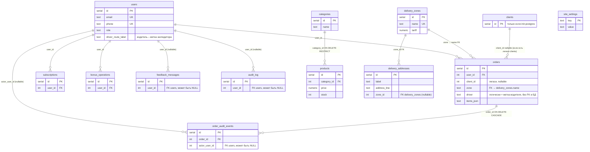

# ER-диаграмма базы данных «ЭкваЛайн» (PostgreSQL)

Схема создаётся и дополняется при старте приложения модулем `db.js` (функции `migrate`, `ensure*`). Ниже — логические связи **в виде ограничений внешнего ключа (FK)** и диаграмма для отчётов или для инструментов вроде **pgAdmin → ERD**.

**Подписи на русском в БД.** Имена таблиц в SQL остаются **латиницей** (иначе пришлось бы переписывать все запросы в `server.js`). В PostgreSQL задаётся **`COMMENT ON TABLE …`** с русским названием — в pgAdmin наведите на таблицу или откройте Properties → **Comment**, чтобы видеть «Заказы», «Пользователи» и т.д.

## Соответствие: имя в SQL → русское название (комментарий в БД)

| Таблица (SQL) | Русское название |
|---------------|------------------|
| `users` | Пользователи |
| `categories` | Категории товаров |
| `products` | Товары |
| `orders` | Заказы |
| `subscriptions` | Подписки на доставку |
| `delivery_zones` | Зоны доставки |
| `bonus_operations` | Операции с бонусами |
| `feedback_messages` | Сообщения обратной связи |
| `site_settings` | Настройки сайта |
| `audit_log` | Журнал аудита |
| `delivery_addresses` | Пресеты адресов доставки |
| `order_audit_events` | События по заказам (аудит) |
| `clients` *(легаси)* | Клиенты (легаси-схема) |
| `express_session` | Сессии веб-приложения |

## Визуальная диаграмма (Mermaid)

Фрагмент ниже можно вставить в Markdown-редактор с поддержкой Mermaid или скопировать на [mermaid.live](https://mermaid.live) и экспортировать в PNG/SVG для ВКР.

## Таблицы без исходящих FK в бизнес-модели

| Таблица | Комментарий |
|---------|--------------|
| `site_settings` | Ключ–значение настроек сайта, универсальное хранилище. |

## Техническая таблица сессий Express

При использовании PostgreSQL-хранилища сессий (`connect-pg-simple`) создаётся таблица **`express_session`**. Связь только с временем хранения cookie; на сущность `users` в проекте **не FK** (идентификатор пользователя в сессии — отдельные поля в JSON/session).

Построить ERD только по «бизнес-таблицам» можно, исключив `express_session` из набора узлов.

## Как открыть диаграмму в pgAdmin 4

1. Подключиться к вашей базе `ekvaline_db` (или имя из `DATABASE_URL`).
2. Схема **public** → ПКМ **ERD For Schema** (*Generate ERD*, в зависимости от версии: *Schemas → public → правый клик → ERD*).
3. В инструменте отобразятся таблицы и **стрелки между ними там, где в БД есть FOREIGN KEY**.

После обновления проекта в ERD должны быть, в частности, связи **orders_zone_fkey** (`orders.zone` ↔ `delivery_zones.name`), **delivery_addresses_zone_id_fkey**, а при наличии легаси-таблицы **clients** — **orders_client_id_fkey**.

## Список ограничений FK (ориентир)

| Дочерняя таблица | Столбец(ы) | Родитель | Поведение |
|------------------|-----------|----------|-----------|
| `products` | `category_id` | `categories(id)` | `ON DELETE RESTRICT` |
| `orders` | `user_id` | `users(id)` | `ON DELETE CASCADE` |
| `orders` | `zone` | `delivery_zones(name)` | `ON DELETE SET NULL` |
| `orders` | `client_id` | `clients(id)` | `ON DELETE SET NULL` *(только если есть таблица `clients`)* |
| `delivery_addresses` | `zone_id` | `delivery_zones(id)` | `ON DELETE SET NULL` |
| `subscriptions` | `user_id` | `users(id)` | `ON DELETE CASCADE` |
| `bonus_operations` | `user_id` | `users(id)` | `ON DELETE CASCADE` |
| `feedback_messages` | `user_id` | `users(id)` | `ON DELETE SET NULL` |
| `audit_log` | `user_id` | `users(id)` | `ON DELETE SET NULL` |
| `order_audit_events` | `order_id` | `orders(id)` | `ON DELETE CASCADE` |
| `order_audit_events` | `actor_user_id` | `users(id)` | `ON DELETE SET NULL` |

Поле **`orders.driver`** остаётся текстовым (**совпадает с** `users.driver_route_label` у роли водителя); отдельного FK в коде данных намеренно нет — иначе потребовались бы правила уникальности метки и дополнительные миграции.

## Устаревший скрипт `scripts/init-postgres.sql`

В репозитории есть учебная заготовка с таблицами `clients` и упрощённым `orders`. **Рабочее приложение** использует модель из `db.js`. Для актуальной ER-диаграммы опирайтесь на миграции `db.js`, а не на `init-postgres.sql`; если обе модели случайно сосуществуют в одной базе — приведите схему к одному варианту.
