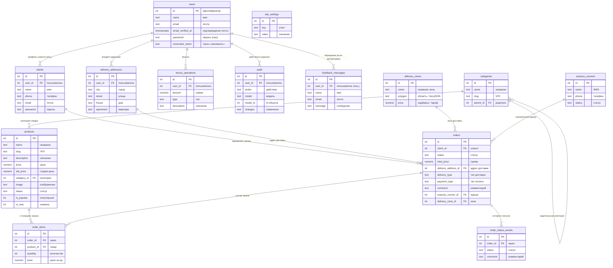

# ER-диаграмма торговой схемы (русские подписи, все основные связи)

Ниже — логическая модель как на вашей схеме: **users**, **clients**, **products**, **categories**, **orders**, **order_items**, **order_status_events**, **delivery_addresses**, **delivery_zones**, **express_couriers**, **bonus_operations**, **audit**, **feedback_messages**, **site_settings**.

## Реализация в PostgreSQL

Таблицы создаются в отдельной схеме **`demo_shop`**, чтобы не мешать проекту ЭкваЛайн:

- SQL-скрипт: **`scripts/schema-demo-shop-er-ru.sql`**
- Запуск:  
  `psql "%DATABASE_URL%" -f scripts/schema-demo-shop-er-ru.sql`  
  (подставьте свою строку подключения из `.env`.)

В скрипте заданы **`COMMENT ON TABLE`** / **`COMMENT ON COLUMN`** на русском — в **pgAdmin** / **DBeaver** подписи будут отображаться рядом с объектами.

## Диаграмма (Mermaid)

Скопируйте в [mermaid.live](https://mermaid.live) для экспорта в PNG/SVG.

## Таблица соответствия (имя SQL → по-русски)

| Объект | Русское название |
|--------|------------------|
| `demo_shop.users` | Пользователи |
| `demo_shop.clients` | Клиенты |
| `demo_shop.categories` | Категории товаров |
| `demo_shop.products` | Товары |
| `demo_shop.orders` | Заказы |
| `demo_shop.order_items` | Позиции заказа |
| `demo_shop.order_status_events` | События статуса заказа |
| `demo_shop.delivery_addresses` | Адреса доставки |
| `demo_shop.delivery_zones` | Зоны доставки |
| `demo_shop.express_couriers` | Экспресс-курьеры |
| `demo_shop.bonus_operations` | Бонусные операции |
| `demo_shop.audit` | Журнал аудита |
| `demo_shop.feedback_messages` | Обратная связь |
| `demo_shop.site_settings` | Настройки сайта |

## Как открыть ERD в pgAdmin

1. Выполните скрипт **`scripts/schema-demo-shop-er-ru.sql`**.
2. В дереве: **Schemas → demo_shop → ПКМ → ERD For Schema** (или аналог в вашей версии).
3. Стрелки появятся по **FOREIGN KEY** автоматически.

## Примечание

Схема **`demo_shop`** живёт отдельно от **`public`** ЭкваЛайн. Таблицы **`users`** и **`clients`** связаны опционально через **`clients.user_id`**.
