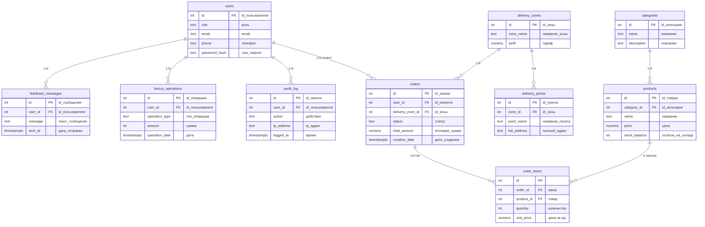

# ER-диаграмма: упрощённая модель магазина (как на учебном чертеже)

Логические сущности: **пользователь**, **обратная связь**, **бонусные операции**, **журнал аудита**, **заказы**, **зона доставки**, **пункты доставки**, **категории**, **товары**. Связь «несколько товаров в одном заказе» задана таблицей **позиций заказа** (`order_items`), что соответствует нормализации связи многие-ко-многим между товарами и заказами.

## Реализация в PostgreSQL

| Что | Где |
|-----|-----|
| DDL и комментарии на русском | **`scripts/schema-er-diagram-simple-ru.sql`** |
| Схема БД | **`er_diagram_shop`** (отдельно от `public` ЭкваЛайн и от `demo_shop`) |

Запуск:

```bash
psql "%DATABASE_URL%" -f scripts/schema-er-diagram-simple-ru.sql
```

После выполнения в **pgAdmin**: схема `er_diagram_shop` → **ERD For Schema** — связи появятся по ограничениям **FOREIGN KEY**.

## Диаграмма (Mermaid)

Скопируйте в [mermaid.live](https://mermaid.live) для экспорта в PNG/SVG.



## Соответствие таблиц SQL и названий на чертеже

| Таблица `er_diagram_shop.*` | По-русски (как на схеме) |
|-----------------------------|---------------------------|
| `users` | Пользователь |
| `feedback_messages` | Обратная связь |
| `bonus_operations` | Бонусные операции |
| `audit_log` | Журнал аудита |
| `orders` | Заказы |
| `delivery_zones` | Зона доставки |
| `delivery_points` | Пункты доставки |
| `categories` | Категории |
| `products` | Товары |
| `order_items` | Позиции заказа (связь товары↔заказы) |
