# Архитектура веб-приложения «ЭкваЛайн»

Документ для раздела курсовой/диплома: **иерархия страниц и файлов**, **символьные схемы модулей**, **перечень функций**.

---

## Как оформить схемы в отчёте (рисунки)

1. **Откройте этот файл** в VS Code / Cursor или на [mermaid.live](https://mermaid.live).
2. Скопируйте блок кода между ` ```mermaid ` и ` ``` `.
3. На mermaid.live выберите тему **Base** (белый фон) → **Export → PNG/SVG** — вставьте в Word как **Рисунок N**.
4. Подпись под рисунком (пример): *«Рисунок 1 — Общая архитектура системы»*, *«Рисунок 2 — Процесс от регистрации до доставки»*.
5. В тексте диплома: *«Структура приложения представлена на рисунке 3»*.

Альтернатива: плагин **Markdown Preview Mermaid Support** → печать в PDF.

---

## 1. Общая архитектура (трёхзвенная)

*Рисунок 1 — как устроена система: браузер, сервер Node.js, база и почта. Подписи на русском, технические имена — на английском.*

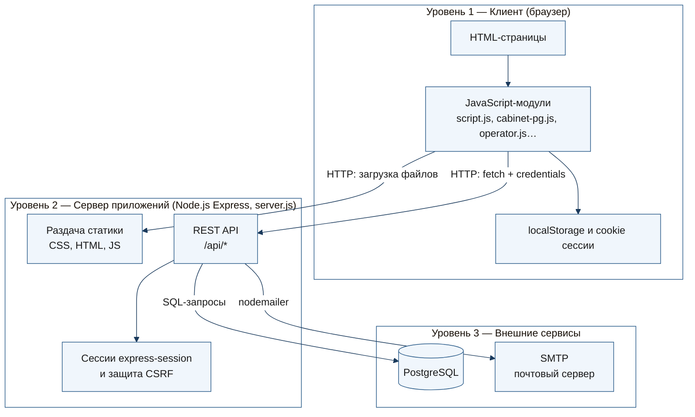

| Уровень | Технологии | Назначение |
|---------|------------|------------|
| Представление | HTML, CSS, JS | Интерфейс по ролям (клиент, оператор, водитель) |
| Логика | Express 4, модули `.js` | API, валидация, бизнес-правила |
| Данные | PostgreSQL, SMTP | Заказы, пользователи, уведомления, письма с кодами |

---

## 2. Процесс работы: клиент → оператор → водитель

*Рисунок 2 — сквозная иерархия: регистрация клиента, заявка, обработка оператором, доставка водителем. Стрелки показывают направление данных; цилиндр — PostgreSQL.*

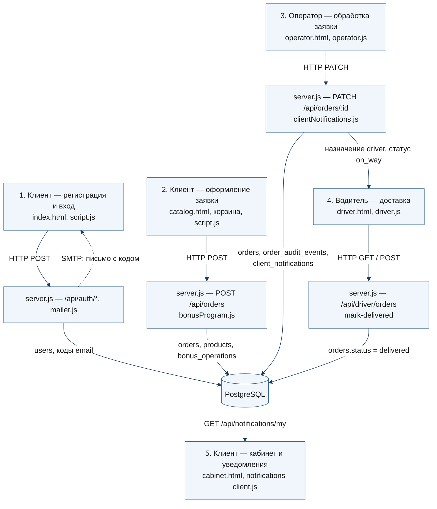

**Пояснение к рисунку 2 (по шагам)**

| Шаг | Кто | Действие | Запись в PostgreSQL |
|-----|-----|----------|---------------------|
| 1 | Клиент | Регистрация, подтверждение email кодом из письма | `users`, коды в `users` |
| 2 | Клиент | Заявка из каталога: адрес, дата, товары, бонусы | `orders`, `products.stock`, `bonus_operations` |
| 3 | Оператор | Подтверждение, перенос, отмена, назначение водителя | `orders`, `order_audit_events` |
| 4 | Водитель | Список маршрута, отметка «Доставлено» | `orders.status` |
| 5 | Клиент | Уведомления в колокольчике и статус в кабинете | `client_notifications` |

---

## 3. Иерархия страниц (навигация и роли)

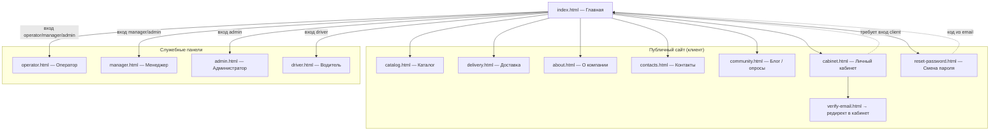

**Роли и доступ к страницам**

| Страница | client | operator | manager | admin | driver |
|----------|--------|----------|---------|-------|--------|
| index, catalog, delivery, about, contacts, community | ✓ | ✓ | ✓ | ✓ | — |
| cabinet, reset-password | ✓ | — | — | — | — |
| operator | — | ✓ | ✓ | ✓ | — |
| manager | — | — | ✓ | ✓ | — |
| admin | — | — | — | ✓ | — |
| driver | — | — | — | — | ✓ |

---

## 4. Зависимости: страницы → клиентские JS/CSS

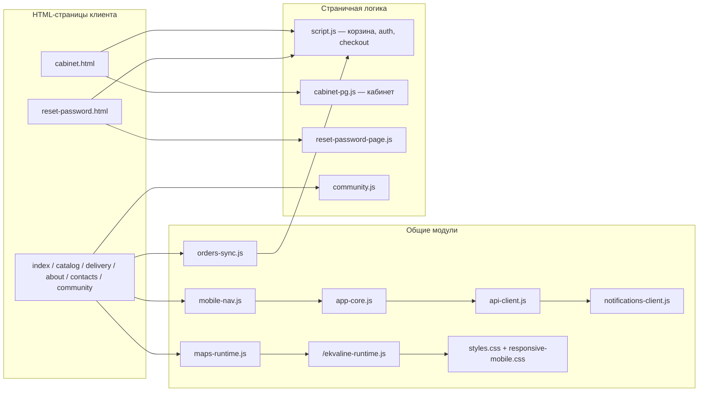

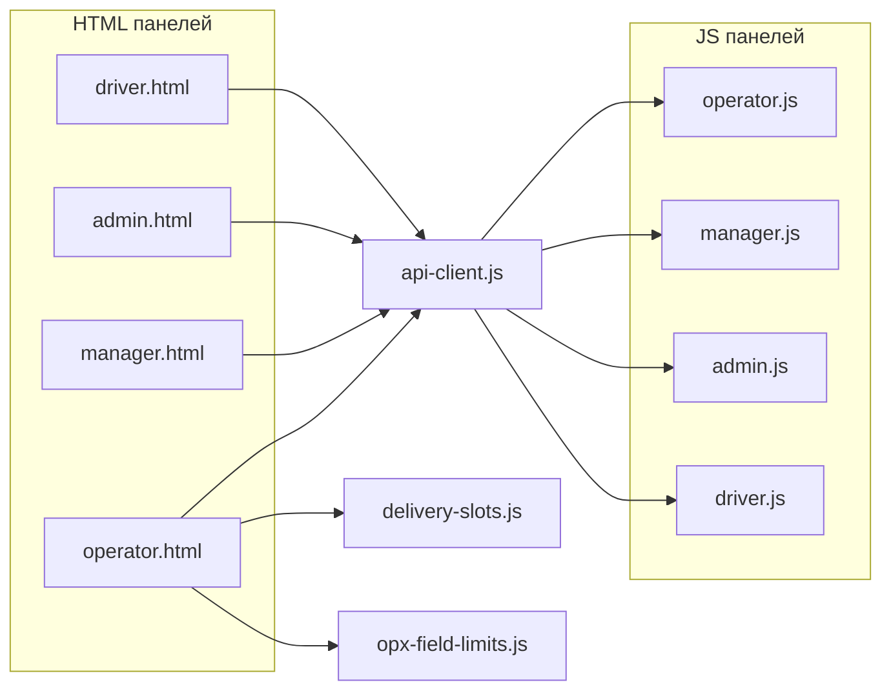

---

## 5. Зависимости сервера: `server.js` → модули

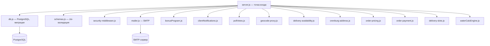

---

## 6. Символьные схемы модулей

### 6.1. Аутентификация и почта

*Рисунок — схема работы модуля регистрации и подтверждения email.*

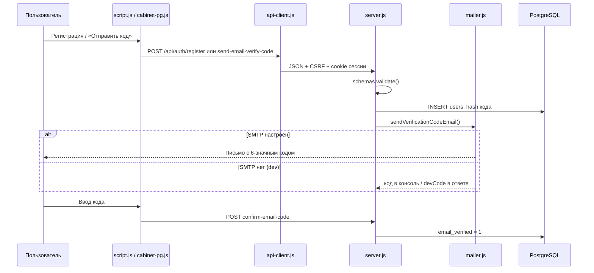

**Основные функции**

| Файл | Функция | Назначение |
|------|---------|------------|
| server.js | `generateAuthCode`, `hashAuthCode`, `verifyAuthCode` | Генерация и проверка 6-значного кода |
| server.js | `sendEmailVerificationForUser` | Запись кода в БД + отправка письма |
| server.js | `sendPasswordResetForUser` | Код смены пароля на email |
| mailer.js | `sendVerificationCodeEmail`, `sendPasswordCodeEmail` | Текст/HTML письма |
| mailer.js | `isMailConfigured`, `verifySmtpConnection` | Проверка SMTP |
| schemas.js | `registerSchema`, `confirmEmailCodeSchema`, … | Валидация полей |
| script.js | обработчики auth-модалки | UI входа/регистрации |
| cabinet-pg.js | `applyEmailCodeDeliveryResponse` | Сообщения и dev-код в кабинете |

---

### 6.2. Оформление заказа (клиент)

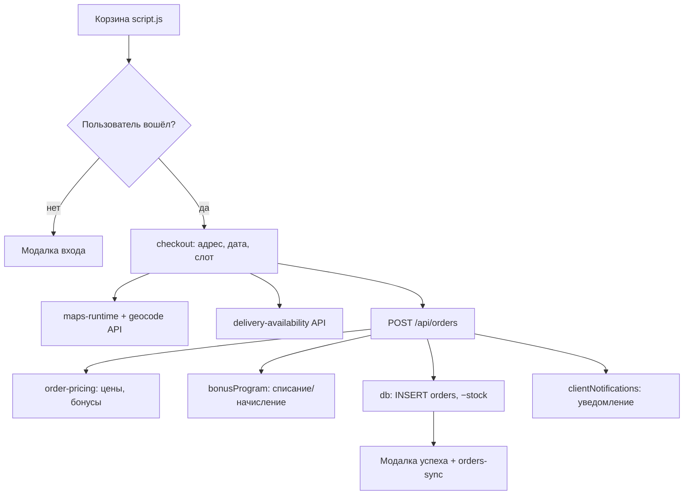

**Основные функции**

| Файл | Функция | Назначение |
|------|---------|------------|
| script.js | `renderCart`, checkout submit | Корзина и отправка заказа |
| order-pricing.js | `resolveStaffOrderItemsPatch`, расчёт строк | Цены и `items_json` |
| bonusProgram.js | `spendUserBonuses`, `accrueUserBonuses` | Бонусы по заказу |
| delivery-availability.js | `validateDeliveryBooking` | Закрытые дни/слоты |
| orenburg-address.js | `validateDeliveryAddressLine` | Адрес только Оренбург |
| orders-sync.js | `notifyOrdersDataChanged` | Синхронизация вкладок |

---

### 6.3. Личный кабинет клиента

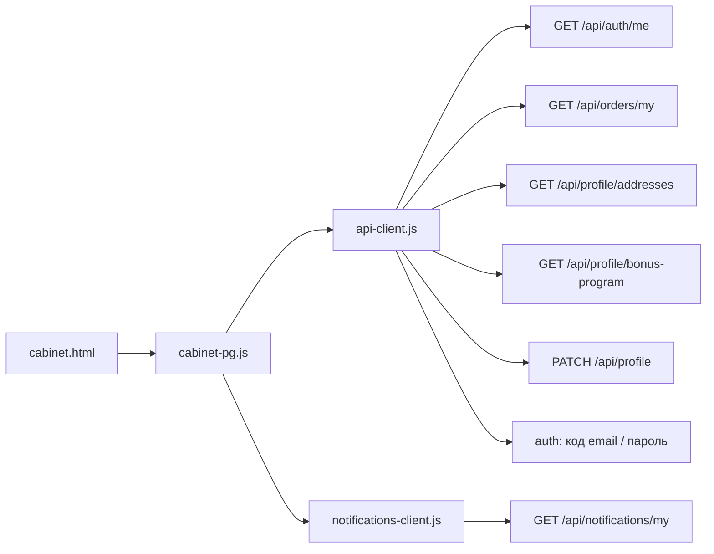

**Основные функции `cabinet-pg.js`**

| Функция | Назначение |
|---------|------------|
| `renderProfile` | Отображение профиля |
| `renderOrders` / `renderOrderCard` | Активные доставки и история |
| `reloadOrders` | Опрос заказов каждые 10 с |
| `renderAddresses` | Сохранённые адреса CRUD |
| `renderBonusProgram` | Баланс, статус, история бонусов |
| `applyEmailCodeDeliveryResponse` | UX отправки кода email |

---

### 6.4. Уведомления на сайте

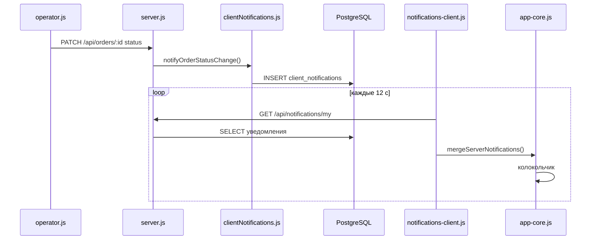

---

### 6.5. Панель оператора

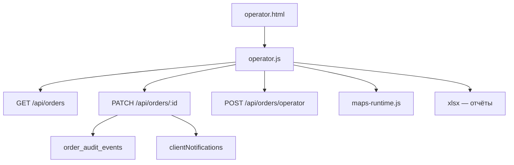

---

### 6.6. Геокодирование

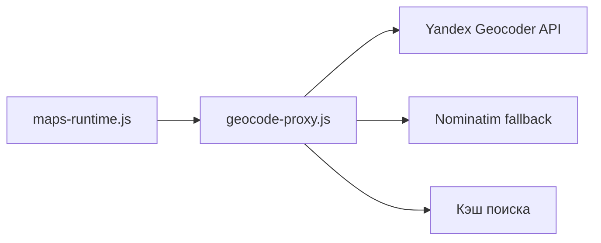

---

### 6.7. База данных (`db.js`)

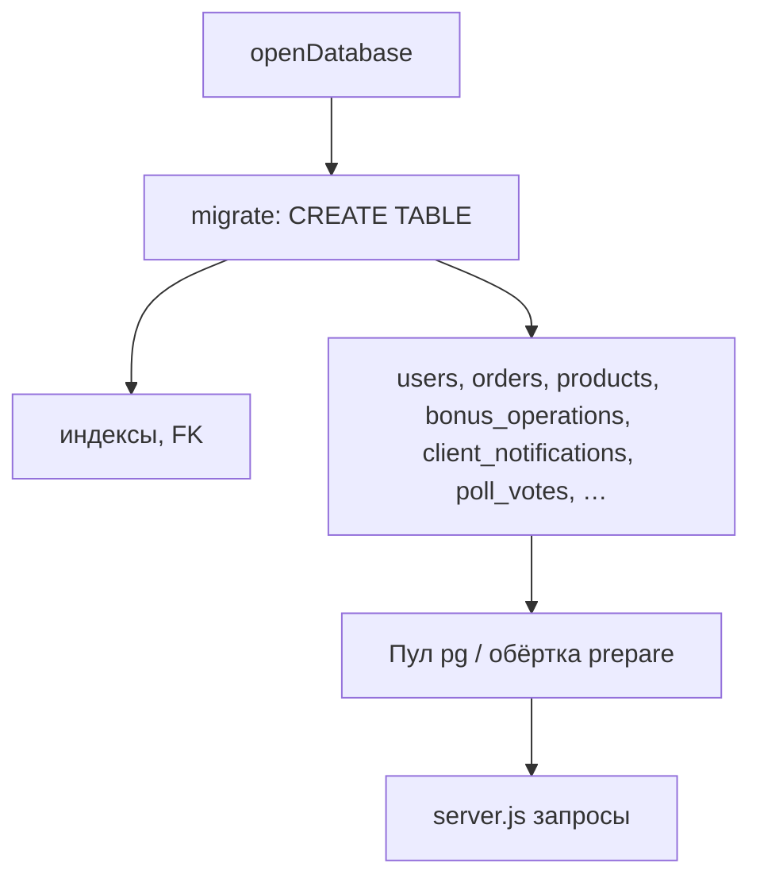

**Ключевые таблицы**

| Таблица | Назначение |
|---------|------------|
| users | Клиенты и сотрудники, роли, коды email/пароля |
| orders | Заказы, статус, доставка |
| products | Каталог, остатки |
| bonus_operations | Начисление/списание бонусов |
| client_notifications | Push-уведомления в колокольчик |
| client_saved_addresses | Адреса клиента |
| order_audit_events | Журнал изменений заказа |
| poll_votes | Голоса в опросах блога |

---

## 7. Карта REST API (укрупнённо)

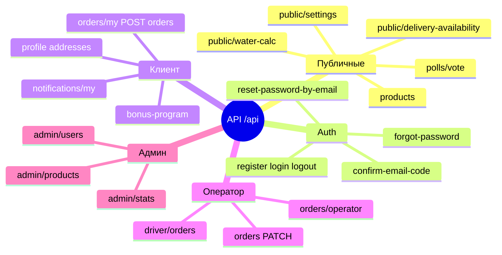

---

## 8. Полный перечень файлов по назначению

### HTML-страницы

| Файл | Роль |
|------|------|
| index.html | Главная, калькулятор воды, вход |
| catalog.html | Каталог и корзина |
| delivery.html | Условия доставки, FAQ |
| about.html | О компании, сертификаты |
| contacts.html | Контакты, обратная связь |
| community.html | Блог, опросы |
| cabinet.html | Личный кабинет |
| reset-password.html | Смена пароля по коду |
| verify-email.html | Редирект в кабинет |
| operator.html | Заказы, клиенты |
| manager.html | Контент, опросы, блог |
| admin.html | Пользователи, товары, зоны |
| driver.html | Маршрут водителя |

### Серверные модули (бизнес-логика)

| Файл | Кратко |
|------|--------|
| server.js | Маршруты API, сессии, оркестрация |
| db.js | Схема БД, миграции |
| schemas.js | Валидация Joi |
| mailer.js | Email SMTP |
| bonusProgram.js | Бонусная программа |
| clientNotifications.js | Уведомления клиента |
| pollVotes.js | Голосование в опросах |
| order-pricing.js | Расчёт суммы заказа |
| order-payment.js | Агрегация оплат в отчётах |
| delivery-availability.js | Календарь доставки |
| delivery-slots.js | Сравнение слотов |
| orenburg-address.js | Валидация адреса |
| geocode-proxy.js | Поиск адреса на карте |
| waterCalcEngine.js | Калькулятор потребления воды |
| security-middleware.js | Заголовки, rate limit |

### Клиентские модули

| Файл | Кратко |
|------|--------|
| script.js | Auth, корзина, checkout, каталог |
| cabinet-pg.js | Кабинет: профиль, заказы, бонусы |
| api-client.js | fetch, CSRF, JSON |
| app-core.js | Уведомления, localStorage, настройки |
| notifications-client.js | Синхронизация уведомлений с API |
| orders-sync.js | Обновление списка заказов между вкладками |
| maps-runtime.js | Яндекс.Карты, выбор адреса |
| mobile-nav.js | Мобильное меню |
| community.js | Блог и опросы |
| operator.js / admin.js / manager.js / driver.js | Панели staff |
| reset-password-page.js | Форма сброса пароля |

---

## 9. Рекомендуемые номера рисунков для диплома

| № | Содержание | Раздел документа |
|---|----------|------------------|
| 1 | Рис. 1 — Общая трёхзвенная архитектура | §1 |
| 2 | Рис. 2 — Процесс: клиент → оператор → водитель | §2 |
| 3 | Рис. 3 — Иерархия страниц и ролей | §3 |
| 4 | Рис. 4 — Зависимости клиентских JS | §4 |
| 5 | Рис. 5 — Модули сервера | §5 |
| 6 | Рис. 6 — Регистрация и email (sequence) | §6.1 |
| 7 | Рис. 7 — Оформление заказа | §6.2 |
| 8 | Рис. 8 — Личный кабинет | §6.3 |
| 9 | Рис. 9 — Уведомления | §6.4 |
| 10 | Рис. 10 — Панель оператора | §6.5 |
| 11 | Рис. 11 — Схема БД (таблицы) | §6.7 |

---

## 10. Текст для вставки в пояснительную записку (шаблон)

> Архитектура веб-приложения «ЭкваЛайн» построена по трёхзвенной модели (рисунок 1). Уровень представления — HTML-страницы и JavaScript в браузере; уровень логики — сервер Node.js (Express) с REST API `/api/*`, сессиями и CSRF; уровень данных — PostgreSQL и SMTP для писем с кодами подтверждения.
>
> Сквозной процесс (рисунок 2): клиент регистрируется и подтверждает email → оформляет заявку в каталоге → оператор обрабатывает заказ и назначает водителя → водитель отмечает доставку → клиент видит статус и уведомления в личном кабинете. Детальные схемы модулей и иерархия страниц приведены в §3–§6.

---

*Файл: `docs/АРХИТЕКТУРА-ВЕБ-ПРИЛОЖЕНИЯ.md` — обновляйте при добавлении новых страниц или API.*
