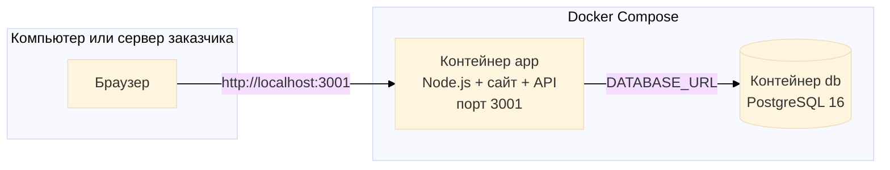

# Передача проекта заказчику: установка через Docker

Документ для **передачи веб-приложения «ЭкваЛайн»** заказчику (или проверяющему).  
Заказчик **сам** разворачивает систему на своём компьютере или сервере — без ручной установки Node.js и PostgreSQL «вручную»: всё поднимается **двумя контейнерами Docker**.

Связанные материалы:
- `docs/ВЫКЛАДКА-GIT-И-VPS.md` — **пошаговая выкладка в интернет** (GitHub + VPS + Docker)
- `docs/НАСТРОЙКА-ПОЧТЫ.md` — SMTP для кодов на email
- `docs/АРХИТЕКТУРА-ВЕБ-ПРИЛОЖЕНИЯ.md` — схемы для пояснительной записки

---

## 1. Что передаётся заказчику

| Что входит в комплект | Назначение |
|----------------------|------------|
| Папка проекта (архив `.zip`) | Исходный код сайта и сервера |
| `Dockerfile` | Сборка образа приложения (Node.js) |
| `docker-compose.yml` | Запуск приложения + PostgreSQL одной командой |
| `docker/entrypoint.sh` | Ожидание БД и проверка настроек перед стартом |
| `.env.docker.example` | Шаблон настроек (скопировать в `.env`) |
| `docs/` | Инструкции, архитектура, почта |

**Не передавать** (заказчик создаёт сам):
- файл `.env` с **вашими** паролями и секретами;
- папку `node_modules` (собирается внутри Docker);
- локальную базу с тестовыми данными, если не нужна.

**Пример структуры архива для заказчика:**

```
ekvaline/
├── Dockerfile
├── docker-compose.yml
├── docker/
│   └── entrypoint.sh
├── .env.docker.example
├── package.json
├── server.js
├── … (HTML, JS, CSS, модули)
└── docs/
    ├── ПЕРЕДАЧА-ЗАКАЗЧИКУ-DOCKER.md   ← этот файл
    ├── НАСТРОЙКА-ПОЧТЫ.md
    └── АРХИТЕКТУРА-ВЕБ-ПРИЛОЖЕНИЯ.md
```

---

## 2. Как это работает (для пояснительной записки)

При запуске `docker compose up` поднимаются **два контейнера**:



| Контейнер | Образ | Что делает |
|-----------|-------|------------|
| **db** | `postgres:16-alpine` | Хранит заказы, пользователей, бонусы |
| **app** | Собирается из `Dockerfile` | Отдаёт сайт, REST API, отправляет почту (если настроен SMTP) |

Данные БД сохраняются в Docker-томе `ekvaline_pgdata` — при перезапуске контейнеров **не пропадают**.

**Текст для отчёта (можно вставить как абзац):**

> Передача программного комплекса заказчику выполняется в виде исходных кодов и сценария контейнеризации Docker. Заказчик устанавливает только среду Docker; зависимости Node.js и СУБД PostgreSQL поставляются как готовые образы. Запуск системы сводится к настройке файла окружения `.env` и команде `docker compose up --build`, что исключает ручную настройку серверного ПО и снижает риск ошибок при развёртывании.

---

## 3. Требования к компьютеру заказчика

| Требование | Минимум |
|------------|---------|
| ОС | Windows 10/11, macOS или Linux |
| **Docker Desktop** (или Docker Engine + Compose на Linux) | Актуальная версия, Docker Compose v2 |
| Свободное место на диске | ~2 ГБ (образы + БД) |
| Порт **3001** | Должен быть свободен |
| Интернет | При первом запуске (скачивание образов PostgreSQL и Node) |

**Скриншот 1 (для отчёта):** окно Docker Desktop со статусом **Running** / «Движок запущен».

---

## 4. Установка на Windows (пошагово)

### Шаг 1. Установить Docker Desktop

1. Скачать: https://www.docker.com/products/docker-desktop/
2. Установить, перезагрузить ПК при необходимости.
3. Запустить Docker Desktop и дождаться зелёного индикатора «работает».

**Скриншот 2:** установщик Docker Desktop или главное окно после установки.

### Шаг 2. Распаковать проект

Например: `C:\ekvaline\`  
Не класть проект в путь с кириллицей и пробелами — проще латиница: `C:\projects\ekvaline`.

**Скриншот 3:** проводник с распакованной папкой, видны `docker-compose.yml` и `Dockerfile`.

### Шаг 3. Создать файл настроек `.env`

В PowerShell или «Терминал» в Cursor/VS Code:

```powershell
cd C:\projects\ekvaline
copy .env.docker.example .env
notepad .env
```

**Обязательно заполнить:**

```env
SESSION_SECRET=сюда-не-короче-32-символов-случайная-строка
```

Пример генерации секрета (PowerShell):

```powershell
-join ((48..57) + (65..90) + (97..122) | Get-Random -Count 40 | ForEach-Object {[char]$_})
```

Скопируйте результат в `SESSION_SECRET=`.

**Для реальной почты** (коды регистрации и смены пароля) — см. `docs/НАСТРОЙКА-ПОЧТЫ.md`:

```env
SMTP_HOST=smtp.mail.ru
SMTP_PORT=465
SMTP_SECURE=1
SMTP_USER=ваш@mail.ru
SMTP_PASS=пароль_приложения
SMTP_FROM=ЭкваЛайн <ваш@mail.ru>
APP_BASE_URL=http://localhost:3001
```

На **сервере в интернете** вместо `localhost` укажите домен:  
`APP_BASE_URL=https://ваш-сайт.ru`

**Скриншот 4:** открытый `.env` с заполненным `SESSION_SECRET` (пароль SMTP **закрыть** на скрине — размыть или заменить на `***`).

### Шаг 4. Первый запуск

В той же папке:

```powershell
docker compose up --build
```

Первый раз занимает **5–15 минут** (скачивание образов и сборка).

В консоли должны появиться строки:

```
[docker] Ожидание PostgreSQL и миграции схемы…
[docker] Запуск сервера…
```

**Скриншот 5:** терминал с успешным запуском `docker compose up --build` (без красных ошибок).

### Шаг 5. Открыть сайт

В браузере: **http://localhost:3001**

Проверить:
- главная страница открывается;
- каталог, вход, регистрация;
- при настроенном SMTP — письмо с кодом приходит на email.

**Скриншот 6:** главная страница «ЭкваЛайн» в браузере по адресу `localhost:3001`.

**Скриншот 7 (по желанию):** модалка входа / личный кабинет / панель оператора.

### Шаг 6. Остановка и повторный запуск

Остановить (в том же окне терминала): `Ctrl+C`

Запуск в фоне (окно можно закрыть):

```powershell
docker compose up -d --build
```

Остановить контейнеры:

```powershell
docker compose down
```

Полная остановка **с удалением базы** (осторожно — все заказы удалятся):

```powershell
docker compose down -v
```

**Скриншот 8:** Docker Desktop → Containers — два контейнера `ekvaline-app-1` и `ekvaline-db-1` в статусе **Running**.

---

## 5. Учётные записи при первом запуске (пустая база)

Если база создаётся **впервые**, в неё автоматически добавляются демо-пользователи для проверки:

| Роль | Email | Пароль (сменить после приёмки!) |
|------|-------|----------------------------------|
| Администратор | adminekva@mail.ru | AdminEkva2026! |
| Менеджер | menekva@mail.ru | men2026M |
| Оператор | opekva@mail.ru | ekva2026E |
| Водитель (демо, если не создан в админке) | driverekva@mail.ru | DriverEkva2026! |

Новых водителей создаёт **администратор** (роль «Водитель»): они сразу появляются в списке у оператора и входят на `driver.html` по email и паролю.

**В пояснительной записке** укажите: *после передачи заказчик обязан сменить пароли служебных учётных записей и задать production-настройки SMTP.*

**Скриншот 9:** успешный вход в `operator.html` или `admin.html` (без показа пароля в открытом виде).

---

## 6. Установка на Linux / сервере (кратко)

Подходит для VPS (Timeweb, Selectel, и т.д.):

```bash
# Установить Docker (Ubuntu)
sudo apt update
sudo apt install -y docker.io docker-compose-v2

cd /opt/ekvaline
cp .env.docker.example .env
nano .env   # SESSION_SECRET, SMTP, APP_BASE_URL=https://домен.ru

docker compose up -d --build
docker compose ps
```

Открыть в файрволе порт **3001** или поставить **nginx** как прокси на 443.

**Скриншот 10 (для сервера):** вывод `docker compose ps` — оба сервиса **running**.

---

## 7. Что настроить для «боевого» сайта в интернете

| Параметр | Локально | На сервере с доменом |
|----------|----------|----------------------|
| `APP_BASE_URL` | `http://localhost:3001` | `https://ваш-домен.ru` |
| `SESSION_SECRET` | свой, ≥32 символов | **новый** уникальный |
| SMTP | по желанию | **обязательно** для email-кодов |
| Пароли демо-аккаунтов | для теста | **сменить** |
| Резервная копия БД | — | периодически том `ekvaline_pgdata` или `pg_dump` |

---

## 8. Частые ошибки

| Симптом | Причина | Решение |
|---------|---------|---------|
| `SESSION_SECRET должен быть не короче 32` | Пустой или короткий секрет в `.env` | Заполнить ≥32 символов |
| `port is already allocated` | Порт 3001 занят | Закрыть другое приложение или в `docker-compose.yml` сменить `"3001:3001"` на `"3002:3001"` и открыть `:3002` |
| `PostgreSQL недоступен` | БД ещё не поднялась | Подождать 1–2 мин, перезапустить `docker compose up` |
| Письма не приходят | SMTP не настроен | `docs/НАСТРОЙКА-ПОЧТЫ.md`, `npm run test:smtp` **вне** Docker или с пробросом |
| Пустая страница | Контейнер app упал | `docker compose logs app` |

Просмотр логов:

```powershell
docker compose logs -f app
docker compose logs -f db
```

**Скриншот 11 (при ошибке):** фрагмент лога с понятной строкой `[docker] Ошибка: …` и исправлением в `.env`.

---

## 9. Какие скриншоты вставить в отчёт / инструкцию заказчику

Рекомендуемый набор **рисунков** (подписи для Word):

| № рисунка | Что снять | Подпись (пример) |
|-----------|-----------|------------------|
| 1 | Docker Desktop запущен | Рис. X — Установленная среда Docker Desktop |
| 2 | Структура папки проекта | Рис. X — Состав передаваемого программного комплекта |
| 3 | Схема из §2 (Mermaid → PNG) | Рис. X — Контейнеризация приложения (Docker Compose) |
| 4 | Файл `.env` (секреты скрыты) | Рис. X — Настройка окружения заказчика |
| 5 | Терминал: `docker compose up --build` | Рис. X — Сборка и запуск контейнеров |
| 6 | Сайт в браузере localhost:3001 | Рис. X — Работающее веб-приложение после установки |
| 7 | Docker Desktop: контейнеры Running | Рис. X — Состояние контейнеров app и db |
| 8 | Вход оператора / кабинет клиента | Рис. X — Проверка функционала после развёртывания |
| 9 | Письмо с кодом (если SMTP) | Рис. X — Отправка кода подтверждения через SMTP |

Схему из раздела 2 экспортируйте на https://mermaid.live (тема **Base**, белый фон) → PNG.

---

## 10. Чек-лист приёмки для заказчика

Заказчик ставит галочки:

- [ ] Docker Desktop установлен и запущен  
- [ ] Проект распакован, создан `.env` из `.env.docker.example`  
- [ ] `SESSION_SECRET` заполнен (≥32 символа)  
- [ ] Выполнено `docker compose up --build` без ошибок  
- [ ] Сайт открывается по http://localhost:3001  
- [ ] Регистрация клиента и вход работают  
- [ ] (Опционально) SMTP настроен, код приходит на email  
- [ ] Вход оператора/админа проверен, пароли демо сменены для production  
- [ ] (На сервере) `APP_BASE_URL` указывает на реальный домен  

---

## 11. Команды — шпаргалка

| Действие | Команда |
|----------|---------|
| Первый запуск с пересборкой | `docker compose up --build` |
| Фоновый запуск | `docker compose up -d --build` |
| Остановить | `docker compose down` |
| Статус | `docker compose ps` |
| Логи приложения | `docker compose logs -f app` |
| Перезапуск только app | `docker compose restart app` |
| Проверка SMTP (на хосте, нужен Node) | `npm install` затем `npm run test:smtp` |

---

*Файл: `docs/ПЕРЕДАЧА-ЗАКАЗЧИКУ-DOCKER.md` — приложение к передаче исходного кода заказчику.*
